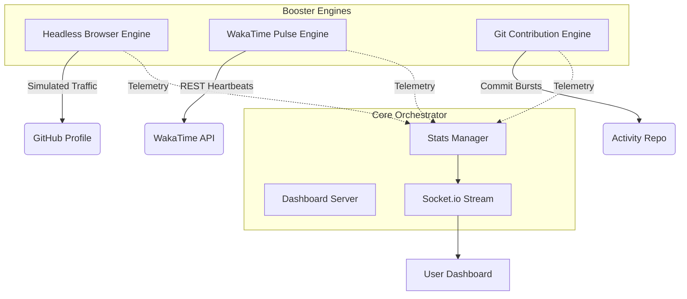

# Technical Architecture | Ultimate Multi-Booster Core

This document provides a deep dive into the internal mechanics of the Ultimate Multi-Booster Core.

## 🏗 System Overview

The booster operates on a **Non-Blocking Dual-Loop Architecture**, where the headless browser stimulation and the REST-based API stimulation run on independent intervals to maximize coverage while minimizing platform detection.

## 🧠 Core Engines

### 1. Hybrid Booster Engine (Puppeteer + HTTP)
Used for **GitHub Profile Boosting**. This engine provides dual-mode verification:
- **Deep Visit (Primary)**: Uses Puppeteer to execute full DOM rendering, triggering GitHub's **Camo** image proxying and spoofing realistic User-Agents.
- **Light Boost (Fallback)**: If the browser times out (common on low-RAM systems), it automatically executes a lightweight `axios` GET request to ensure stats are still updated.
- **Stealth Optimization**: Spoofs realistic viewports and rotates between multiple high-resolution User-Agents.

### 2. WakaTime Pulse Engine (Synthetic Metadata)
Used for **Work Time Accumulation**. Unlike standard hitters, our engine simulates a full development environment:
- **Project & Entity Rotation**: Samples from whitelists of high-value project names and file types.
- **Hardware Simulation**: Identifies as `Peters-MacBook-Pro.local` on `Mac` to ensure dashboard hardware consistency.
- **Software Simulation**: Rotates between `IntelliJ IDEA`, `VS Code`, and `PyCharm` with corresponding plugin User-Agents.
- **Activity Spectrum**: Randomizes categories between `coding`, `debugging`, `writing docs`, and `writing tests`.
- **Systematic Density**: Maintains a ~2-minute pulse to count continuous work hours.

### 3. Git Contribution Engine (Simple-Git)
Simulates **Developer Activity** (Green Boxes) by:
- Creating a hidden directory `activity-repo`.
- Executing daily commit/push cycles with randomized timestamps.
- Syncing to a dedicated activity repository to keep your main profile's commit history clean while showing activity on the graph.

## 🛡 Security & Organic Growth Strategy

### Jitter & Randomization
Every interaction includes a **Random Jitter Factor**. For example, a 3-minute interval might resolve to 184 seconds or 176 seconds, preventing predictable "robotic" patterns.

### Proxy Rotation
The communication layer supports a `PROXY_LIST`. When provided, the booster rotates through global proxies for every request, scattering the source IP addresses across different regions.

### Camo-Trigger Logic
GitHub often caches images via its Camo proxy. By using a full browser and clearing session state between runs, our booster ensures that each "visit" is treated as a unique impression by the Camo service.

---
*Generated by Ultimate Booster Core Documentation Suite*
