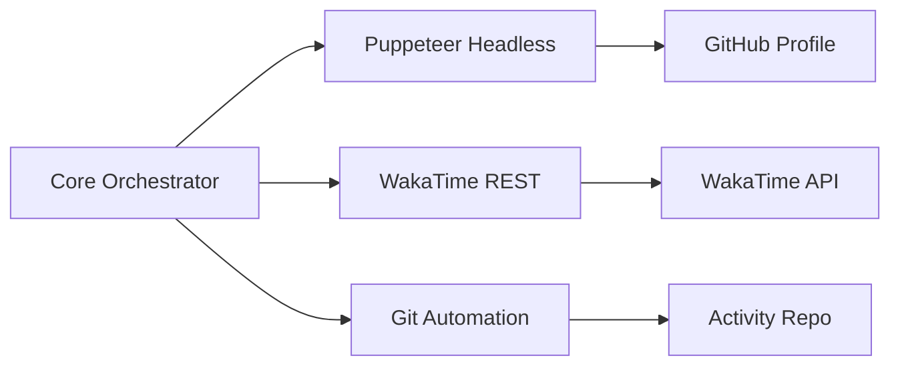

# 🛸 Ultimate Multi-Booster Core

A professional-grade, systematic automation suite for developers to maximize their online presence. This tool automates GitHub profile views, WakaTime statistics, and GitHub activity (green boxes) with organic simulation and a live premium dashboard.

## 🏗 Technical Architecture

The system operates on an asynchronous dual-loop architecture to ensure 24/7 coverage across all platforms.


> [!TIP]
> For a deep-dive into the internal mechanics, check out [ARCHITECTURE.md](./ARCHITECTURE.md).

## 🚀 Key Features

- **Live Cyberpunk Dashboard**: Real-time monitoring via a stunning Glassmorphism web UI (`localhost:3030`).
- **Hybrid Booster Engine**: Advanced logic that combines Puppeteer "Deep Visits" with lightweight HTTP fallbacks to ensure 100% reliable stats.
- **Advanced WakaTime Pulses**: Simulates specific hardware (Mac), editors (IntelliJ, VS Code, PyCharm), and activities (Coding, Debugging, Writing Docs) for a professional dashboard presence.
- **GitHub Contribution Bot**: Automated daily activity bursts (commits) to keep your graph green.
- **Proxy Rotation Support**: Built-in engine to rotate through global proxies and avoid rate-limiting.

## 🛠 Configuration (.env)

| Variable | Description | Recommended |
|----------|-------------|-------------|
| `WAKATIME_API_KEY` | Your WakaTime secret key | Mandatory |
| `TARGET_URL` | Your GitHub profile/counter URL | Mandatory |
| `GITHUB_TOKEN` | Personal Access Token (PAT) | Mandatory for Git Bot |
| `GITHUB_REPO` | `username/repo` for activity | Dedicated Repo |
| `INTERVAL_MINUTES` | Browser loop frequency | `5` |
| `WAKATIME_INTERVAL` | API heartbeat frequency | `2` |
| `PROXY_LIST` | Comma-separated proxies | Optional |

## 📦 Setup & Deployment

You can deploy the booster locally using Docker or to a cluster using Kubernetes.

### Option 1: Docker (Local / VPS)
1. **Configure Environment**: Populate your `.env` with platform credentials.
2. **Launch Container**:
   ```bash
   docker compose up -d --build --force-recreate
   ```
3. **Monitor Live**: Open **`http://localhost:3030`** for real-time telemetry.

### Option 2: Kubernetes (Cluster Deployment)
1. **Configure Environment**: Provide your runtime environment variables inside the `k8s/configmap.yaml` file.
2. **Apply Manifests**: Deploy the booster, service, and configuration natively into your K8s cluster.
   ```bash
   kubectl apply -f k8s/
   ```
3. **Access UI**: The dashboard is exposed internally via `ClusterIP` on port `3030`. Port-forward locally or attach an Ingress/NodePort based on your network architecture.

## 📊 Dashboard Preview
The dashboard provides a glassmorphism terminal view with:
- **Earned Work Time**: Total time simulated today.
- **Profile Gain**: Real-time counter of successful headless visits.
- **System Log**: Encrypted stream of background operations.

## ☁️ Cloud Deployment (24/7 Operation)

For maximum uptime, deploy to a VPS using the provided Docker configuration:
1. **Server Setup**: Install Docker and Docker Compose on your instance.
2. **Transfer**: Copy this directory to `/opt/gh-profile-booster`.
3. **Background Run**:
   ```bash
   docker-compose up -d --build
   ```
4. **Firewall**: Ensure port **3030** is open if you want to access the dashboard remotely (recommend using an SSH tunnel for security).

## 🛡️ Privacy & Activity Strategy

To keep your automated commits "stealthy":
1. Create a dedicated repository (e.g., `activity-sync`).
2. Set the repository to **Private** in GitHub settings.
3. Your "Green Squares" will still appear on your profile graph, but the commit history will be hidden from the public.
4. Ensure your `GITHUB_REPO` in `.env` points to this private repo.

## 🔍 Troubleshooting

> [!WARNING]
> **Headless Browser Fails**: If you see "Chromium not found," ensure the `PUPPETEER_EXECUTABLE_PATH` in `.env` matches the path inside the container (`/usr/bin/chromium`).
>
> **WakaTime 401 Error**: Double-check your API key and ensure it has "write" permissions for heartbeats.
>
> **Git Push Fails**: Verify your PAT has `repo` and `workflow` permissions.

## ⚠️ Disclaimer
This tool is for educational purposes. Please ensure your use case complies with the terms of service of the respective platforms.
