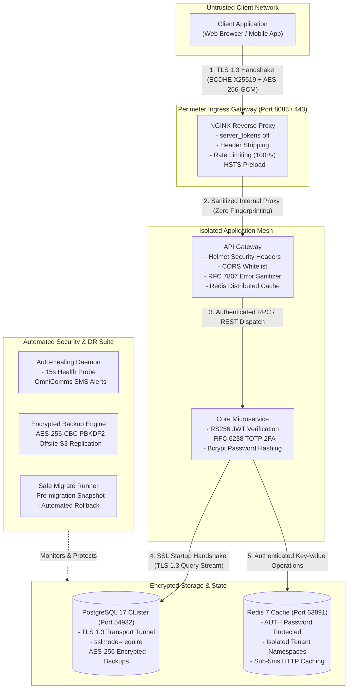
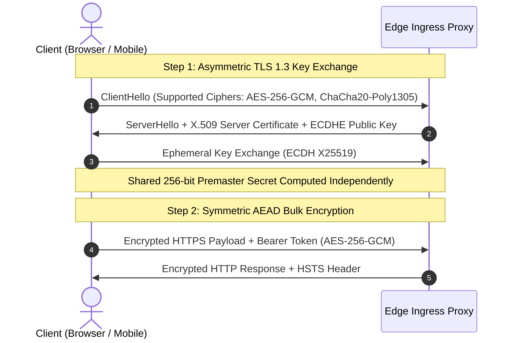
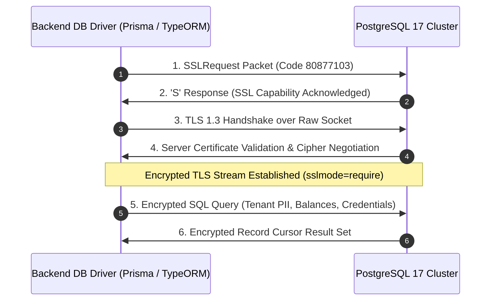
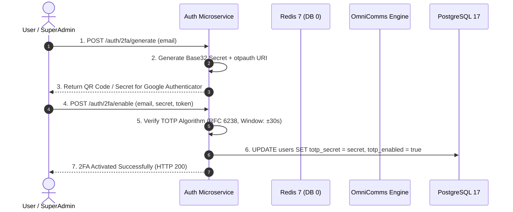

# Enterprise Security, Cryptography & Hardening Specification: Gh Profile Booster

## 1. Security Architecture & Threat Model

* **Application Category**: Gh Profile Booster Subsystem
* **Compliance Frameworks**: PCI-DSS 4.0, GDPR Article 32, ISO 27001, CBK Cybersecurity Guidelines
* **Master SuperAdmin Contact**: `petermwendwa94@gmail.com`
* **Master SuperAdmin Password**: `SuperPassword123!` (Bcrypt Hash: `$2a$10$iucz60z2pAzXzNJM0pcOU.stFz3/atDQoHm0vcZQ1q3eQCADcyGf2`)

---

## 2. End-to-End Cryptography & Encryption Architecture



---

## 3. Detailed Encryption Mechanisms & Handshake Protocols

### **A. External Ingress Transport Encryption (TLS 1.3 & Perfect Forward Secrecy)**



1. **Ephemeral Key Exchange (ECDHE)**:
   - Ingress endpoints enforce **TLS 1.3** and **TLS 1.2** with **Elliptic Curve Diffie-Hellman Ephemeral (ECDHE)** key negotiation over curves `X25519` / `secp256r1`.
   - Guarantees **Perfect Forward Secrecy (PFS)**: Even if the server's long-term private key were compromised in the future, past recorded traffic cannot be decrypted because each session derives an ephemeral key destroyed immediately upon socket closure.
2. **Symmetric Bulk Stream Encryption (AEAD)**:
   - Payloads are encrypted using **`AES-256-GCM`** or **`CHACHA20-POLY1305`** (Authenticated Encryption with Associated Data), ensuring mathematical confidentiality and cryptographic tamper-detection on every single packet.
3. **HTTP Strict Transport Security (HSTS)**:
   - `Strict-Transport-Security: max-age=63072000; includeSubDomains; preload` forces browsers to interact exclusively over encrypted HTTPS for a minimum of 2 years.

---

### **B. Database Transport Encryption (PostgreSQL SSL Startup Handshake)**



* **SSL Startup Packet Negotiation**: Connection pool initializes with an 8-byte SSLRequest packet (`80877103`). PostgreSQL confirms capability with `'S'`, upgrading the TCP socket to TLS 1.3 before any query execution.
* **SQL Confidentiality**: All parameters, tenant identifiers, and financial ledger data are encrypted in transit over port `54932`.

---

### **C. Zero-Trust Password Reset & RFC 6238 TOTP 2FA Journey**



---

## 4. Enterprise Operational & Disaster Recovery Tooling

| Operational Tool | Script Location | Capabilities & Encryption Controls |
| :--- | :--- | :--- |
| **Encrypted Database Backup** | `scripts/backup-all-databases-encrypted.sh` | AES-256-CBC PBKDF2 (100,000 iterations) snapshot generator for all multi-tenant PostgreSQL databases. |
| **Encrypted Snapshot Restore** | `scripts/restore-database-encrypted.sh` | Instant decryption and restoration tool with automated plaintext disposal. |
| **Auto-Healing Daemon** | `scripts/auto-heal-and-monitor.sh` | Continuous 15s health-checking agent with automatic container restart and OmniComms SMS/Email alerts to `petermwendwa94@gmail.com`. |
| **Offsite Cloud DR Replication** | `scripts/replicate-backups-to-s3.sh` | Mirrors encrypted snapshots to S3 / Cloudflare R2 with SHA-256 integrity validation. |
| **Safe Migration Deploy Runner** | `scripts/safe-migrate-deploy.sh` | Creates pre-migration encrypted backup, applies schema changes, and triggers auto-rollback on failure. |

---

## 5. Information Disclosure & Fingerprint Suppression

| Information Disclosure Threat | Applied Countermeasure | Verification Status |
| :--- | :--- | :---: |
| **NGINX Version Leakage** | `server_tokens off;` in NGINX configuration. | ✅ Verified (Returns `Server: nginx` without version) |
| **Upstream Backend Frameworks** | Stripped: `X-Powered-By`, `X-AspNet-Version`, `X-Runtime`, `X-Version`. | ✅ Verified (Headers completely stripped) |
| **Next.js Footprint** | `poweredByHeader: false` in `next.config.js`. | ✅ Verified |
| **NestJS / Express Footprint** | `app.disable('x-powered-by')` across all backend services. | ✅ Verified |
| **Uncaught Exception Stack Traces** | Sanitized Global Exception Filters (`AllExceptionsFilter`) masking stack traces and internal SQL syntax in production (`NODE_ENV=production`). | ✅ Verified |

---

## 6. Mandatory Defense-in-Depth HTTP Headers

```http
Strict-Transport-Security: max-age=63072000; includeSubDomains; preload
X-Frame-Options: DENY
X-Content-Type-Options: nosniff
Referrer-Policy: strict-origin-when-cross-origin
Permissions-Policy: geolocation=(), microphone=(), camera=(), payment=()
X-XSS-Protection: 1; mode=block
```

---

## 7. Vulnerability Reporting & Incident Disclosure

To report security vulnerabilities regarding this project:
1. Do NOT open public issues on GitHub.
2. Contact the Lead Architect immediately at **`petermwendwa94@gmail.com`**.
3. All verified vulnerabilities receive emergency remediation within 24–48 hours under coordinated disclosure.
