# Akiba360 Digital Sacco & Chama: System Architecture & Infrastructure Blueprint

## 1. System Overview
Akiba360 is an enterprise multi-tenant, microservices-based financial platform for SACCOs and Investment Chamas. It provides end-to-end accounting, member savings, share capital management, loan disbursement/repayment schedules, SASRA regulatory compliance, AI credit scoring, and an ecosystem-wide **OmniComms Universal Communications Suite**.

---

## 2. Microservice Topology & Port Mapping

| Service Name | Container | Internal Port | Host Port | Role / Function |
| :--- | :--- | :--- | :--- | :--- |
| **API Gateway** | `digital-sacco-chama-management-app-gateway-1` | `7847` | `7847` | Central JWT Authentication, Rate Limiting & Routing |
| **Admin Web Portal** | `digital-sacco-chama-management-app-admin-1` | `80` | `3000` | Sacco Staff, Branch & Chama Officer Interface |
| **SuperAdmin Portal** | `digital-sacco-chama-management-app-superadmin-1` | `80` | `3001` | Multi-Tenant Platform Operator & Billing Portal |
| **OmniComms Dashboard** | `digital-sacco-chama-management-app-comms-dashboard-1` | `80` | `7891` | Enterprise Communications Suite & Mission Control |
| **OmniComms Gateway** | `digital-sacco-chama-management-app-comms-gateway-1` | `7890` | `7890` | Multi-Tenant Email/SMS/Push Ingestion & 2FA Vault |
| **Edge Proxy** | `digital-sacco-chama-management-app-nginx-1` | `80` | `9443` | SSL Termination & Static Caching |
| **Auth Microservice** | `digital-sacco-chama-management-app-auth-1` | `7848` | Internal | Password hashing, MFA TOTP & Session Tokens |
| **Members Microservice**| `digital-sacco-chama-management-app-members-1` | `7849` | Internal | Member Profiles, Next-of-Kin, Chama Groups |
| **Financial Ledger** | `digital-sacco-chama-management-app-financial-1` | `7850` | Internal | Double-entry Chart of Accounts, Savings, Shares |
| **Payments Microservice**| `digital-sacco-chama-management-app-payments-1` | `7851` | Internal | M-Pesa C2B/B2C STK Push & Bank Rails |
| **KYC Microservice** | `digital-sacco-chama-management-app-kyc-1` | `7852` | Internal | National ID OCR & Document Verification |
| **Tenants Microservice**| `digital-sacco-chama-management-app-tenants-1` | `7853` | Internal | Sacco Tenant Isolation & Custom Branding |
| **Reports Microservice**| `digital-sacco-chama-management-app-reports-1` | `7854` | Internal | SASRA Regulatory Filings & PDF Statements |
| **Tickets Microservice**| `digital-sacco-chama-management-app-tickets-1` | `7855` | Internal | Member Support Tickets & Dispute Resolution |
| **Storage Microservice**| `digital-sacco-chama-management-app-storage-1` | `7856` | Internal | S3 File Upload Engine & Presigned URLs |
| **Notifications Microservice** | `digital-sacco-chama-management-app-notifications-1`| `7857`| Internal | OmniComms Client Adapter & Sacco Event Bridge |
| **Monitoring Microservice** | `digital-sacco-chama-management-app-monitoring-1` | `7858` | Internal | Health Checks, Latency & Error Telemetry |
| **SuperAdmin Backend** | `digital-sacco-chama-management-app-super-admin-1` | `7859` | Internal | Global Tenant Provisioning, User Provisioning & Billing |
| **Audit Microservice** | `digital-sacco-chama-management-app-audit-1` | `7860` | Internal | Immutable Audit Logs & Compliance Ledger |
| **AI Credit Sidecar** | `digital-sacco-chama-management-app-ai-service-1` | `7861` | Internal | Python ML/LLM Credit Worthiness Scoring |

---

## 3. Architecture Topology & Communications Mesh

```mermaid
graph TD
    subgraph Clients["Sacco Client Interfaces & Portals"]
        C_ADMIN["Admin Portal (:3000)"]
        C_SUPER["SuperAdmin Portal (:3001)"]
        C_COMMS["OmniComms Suite (:7891)"]
        C_MOB["Mobile App (Expo / React Native)"]
    end

    subgraph Ingress["Edge & API Gateways"]
        EDGE["Edge NGINX (:9443)"]
        GW["Core API Gateway (:7847)"]
        COMMS_GW["OmniComms REST Gateway (:7890)"]
    end

    subgraph SaccoServices["Core Microservices Mesh"]
        AUTH["Auth (:7848)"]
        MEM["Members (:7849)"]
        FIN["Financial Ledger (:7850)"]
        PAY["Payments (:7851)"]
        KYC["KYC & AML (:7852)"]
        TEN["Tenants (:7853)"]
        REP["Reports (:7854)"]
        NOTIF["Notifications (:7857)"]
        STOR["Storage Adapter (:7856)"]
        SA_SVC["SuperAdmin Service (:7859)"]
        AUD["Audit (:7860)"]
        AI["AI Credit Sidecar (:7861)"]
    end

    subgraph CommsEngines["OmniComms Full-Suite Engines (:7890)"]
        TMPL["Template Studio & Handlebars Engine"]
        OTP_V["Central 2FA & OTP Sessions Vault"]
        Q_DLQ["Queue & DLQ Mission Control"]
        PROV["Provider Routing (SMTP / Africa's Talking / Twilio)"]
        AUD_LOG["Security & Compliance Audit Trail"]
    end

    subgraph SharedInfra["Enterprise Shared Infrastructure"]
        PG[("PostgreSQL 17: digital_sacco_db (:54932)")]
        REDIS[("Redis 7: DB 0 sacco:* (:63891)")]
        MQ["RabbitMQ: vhost /sacco (:5672)"]
        S3[("MinIO S3: sacco-vault (:9000)")]
        OLLAMA["Ollama AI Engine (:11434)"]
    end

    C_ADMIN & C_SUPER & C_MOB --> EDGE --> GW
    C_COMMS --> COMMS_GW
    GW --> AUTH & MEM & FIN & PAY & KYC & TEN & REP & NOTIF & STOR & SA_SVC & AUD & AI
    NOTIF --> COMMS_GW
    COMMS_GW --> TMPL & OTP_V & Q_DLQ & PROV & AUD_LOG

    AUTH & MEM & FIN & TEN & REP & SA_SVC --> PG
    AUTH & NOTIF & COMMS_GW --> REDIS
    PAY & NOTIF --> MQ
    STOR & KYC --> S3
    AI --> OLLAMA
```

---

## 4. SuperAdmin Global Access & User Delegation

* **Universal SuperAdmin Email**: `petermwendwa94@gmail.com`
* **SuperAdmin Master Roles**:
  * Unrestricted access to all system APIs, financial parameters, KYC verification queues, and audit logs.
  * Direct ability to provision and configure other administrative users via `POST /api/v1/super-admin/users`:
    - `TENANT_ADMIN`: Sacco / Chama manager with tenant-scoped permissions.
    - `ACCOUNTANT`: Read/write access to general ledger, reconciliation, and reports.
    - `LOAN_OFFICER`: Loan product creation, appraisal, and guarantor verification.
    - `SUPPORT_ADMIN`: Customer support tickets, dispute handling, and member inquiries.
* **Password Reset Journey**:
  - `POST /api/v1/auth/request-reset`: Triggers OTP dispatch via OmniComms.
  - `POST /api/v1/auth/verify-reset-otp`: Validates code within 10-minute TTL and returns `resetToken`.
  - `POST /api/v1/auth/reset-password`: Sets new bcrypt-hashed password, validates history (last 5 passwords), and terminates active sessions globally.

---

## 5. OmniComms Universal Communications Suite Modules

1. **System Command Center**: Real-time throughput metrics, delivery success gauge, provider telemetry.
2. **Applications & API Keys**: Scoped multi-tenant project registration, cryptographic API key generation, rate limits.
3. **Message & Delivery Receipts Explorer**: Paginated immutable dispatch ledger, receipts, transient payload pruning.
4. **Template Studio & Engine**: Visual Handlebars editor with Desktop/Mobile responsive preview and mock variables.
5. **Central 2FA & OTP Sessions Vault**: Live token session monitoring, real-time TTL countdown bars, brute-force defense, manual session revocation.
6. **Queue & DLQ Mission Control**: In-flight ingestion counters, active worker concurrency, bulk DLQ retry & purge.
7. **Provider Gateway Routing**: SMTP (Gmail / SendGrid), Africa's Talking SMS, and Twilio.
8. **Interactive Developer Sandbox**: Live API simulator with cURL, TypeScript, and Python SDK code generators.
9. **Security & Compliance Audit Log**: Immutable record of key rotations, credential edits, and access.

---

## 6. Shared Infrastructure Integration
* **Database**: `digital_sacco_db` on `teratech-shared-postgres` (`:54932`) via `teratech_admin`.
* **Redis Cluster**: Host Port `63891` with namespace `sacco:*`.
* **RabbitMQ Virtual Host**: `/sacco` on Host Port `5672` (Management UI: `15672`).
* **MinIO Object Vault**: `sacco-vault` on Host Port `9000` (Console: `9001`).
* **SuperAdmin**: `petermwendwa94@gmail.com` / `SuperPassword123!`
