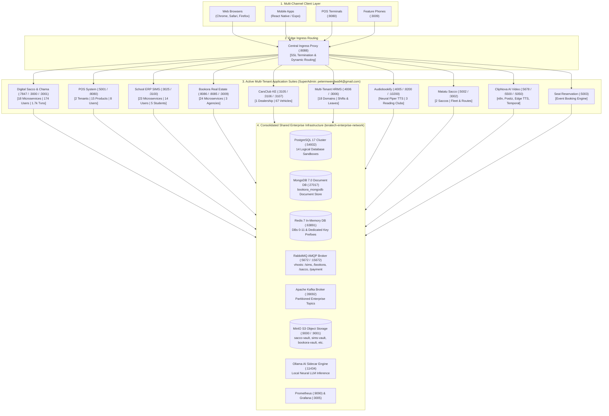

# Teratech Multi-Tenant Enterprise Ecosystem: Operational Walkthrough & Master Directory

## System Status: **100% Operational, Fully Consolidated & Seeded**
All microservices and backing databases across the entire application suite are **UP and running** on their dedicated host ports and wired to the unified `teratech-enterprise-network`.

---

## 1. Global Architectural Master Diagram

---

## 2. Seeded Database Verification & Access Links

1. **Digital Sacco & Chama Management App** (`digital_sacco_db`):
   - **4 Tenants**: Demo Sacco Ltd, Nairobi Traders Sacco, Tech Ventures Chama, Mombasa Port Sacco
   - **174 Users**, **169 Member Profiles**, **169 Savings Accounts**, **109 Active Loans**, **1,745 Financial Transactions**.
   - **SuperAdmin**: `petermwendwa94@gmail.com` / `SuperPassword123!` ([http://localhost:3001](http://localhost:3001))
   - **Tenant Admin**: `admin@demosacco.co.ke` / `Admin@2026!` ([http://localhost:3000](http://localhost:3000))

2. **POS System** (`pos_db`):
   - **2 Store Outlets**: Demo Shop (`demo-shop`), Savanna Mart (`savanna-mart`)
   - **8 Users**, **15 Retail Products**, **4 Stores**, **6 Registered Customers**, **4 Subscription Plans**.
   - **SuperAdmin**: `petermwendwa94@gmail.com` / `SuperPassword123!` ([http://localhost:8080](http://localhost:8080))
   - **Cashier**: `cashier@demo-shop.com` / `password123`

3. **School ERP - SIMS** (`school_erp_db`):
   - **1 School Tenant**: Sault Ste. Marie Academy
   - **14 Staff/Parent/Student Users**, **5 Enrolled Students**, Fee Structures and Payment Records.
   - **SuperAdmin**: `petermwendwa94@gmail.com` / `SuperPassword123!` ([http://localhost:3100](http://localhost:3100))
   - **School Admin**: `admin@saultacademy.com` / `password123`

4. **Bookora Platform** (`bookora_db` & `bookora_mongodb`):
   - **3 Agencies**: Sunny Rentals, Coast Villas, City Lofts
   - **3 Seeded Properties** in shared MongoDB (`bookora_mongodb`).
   - **SuperAdmin**: `petermwendwa94@gmail.com` / `SuperPassword123!` ([http://localhost:8085](http://localhost:8085))
   - **Tenant Owner**: `john@sunnyrentals.com` / `Host@2026!`

5. **Multi-Tenant HRMS** (`multi_tenant_hrms_db`):
   - **2 Tenants**, **9 Users**, **3 Shift Templates**, **6 Leave Types**, Department Settings & Notification Templates.
   - **SuperAdmin**: `petermwendwa94@gmail.com` / `SuperPassword123!` ([http://localhost:3006](http://localhost:3006))
   - **HR Manager**: `alice.manager@demo.com` / `Password@123`

6. **CarsClub KE** (`carsclub_db`):
   - **1 Organization Tenant**, **7 Users**, **67 Dealership Vehicles in Stock**.
   - **SuperAdmin**: `petermwendwa94@gmail.com` / `SuperPassword123!` ([http://localhost:3106](http://localhost:3106))
   - **Dealership Owner**: `owner@apexmotors.ke` / `Admin@123` ([http://localhost:3107](http://localhost:3107))

7. **Matatu Sacco App** (`matatu_sacco_db`):
   - **2 Sacco Tenants**: Nairobi Express SACCO, Mombasa Smart Transport
   - **3 Users/Admins**, Stage Queues, Fare Charts, SMS Notification Templates.
   - **SuperAdmin**: `petermwendwa94@gmail.com` / `SuperPassword123!` ([http://localhost:3002](http://localhost:3002))
   - **Sacco Admin**: `james.mwangi@nairobiexpress.co.ke` / `Nairobi@123`

8. **Audiobookify** (`audiobookify_db`):
   - **9 Users**, **3 Subscription Plans** (Free, Premium, Enterprise), **3 Reading Clubs**.
   - **SuperAdmin**: `petermwendwa94@gmail.com` / `SuperPassword123!` ([http://localhost:4005](http://localhost:4005))
   - **Demo Listener**: `demo@audiobookify.com` / `Test123!`

9. **ClipNova** (`clipnova_db`):
   - **Automated AI Video Creation & Social Media Publishing Pipeline**.
   - **SuperAdmin**: `petermwendwa94@gmail.com` / `SuperPassword123!` ([http://localhost:5678](http://localhost:5678))
