# Akiba360 — Full System Documentation

> **Akiba360** is a cloud-native, multi-tenant SACCO & Chama management platform built on a microservices architecture. It provides comprehensive financial management for Savings and Credit Cooperative Organizations (SACCOs) and investment groups (Chamas) across East Africa.

---

## Table of Contents

1. [Platform Overview](#1-platform-overview)
2. [System Architecture](#2-system-architecture)
3. [Microservices Deep Dive](#3-microservices-deep-dive)
4. [Database Schema](#4-database-schema)
5. [Client Applications](#5-client-applications)
6. [Authentication & Security](#6-authentication--security)
7. [Payment Integrations](#7-payment-integrations)
8. [Infrastructure & Deployment](#8-infrastructure--deployment)
9. [CI/CD Pipeline](#9-cicd-pipeline)
10. [API Reference](#10-api-reference)

---

## 1. Platform Overview

### What is Akiba360?

Akiba360 is a Software-as-a-Service (SaaS) platform that digitizes the operations of SACCOs and Chamas. It supports:

- **Multi-tenancy** — A single deployment serves multiple SACCOs, each with isolated data, branding, and configuration
- **Full financial lifecycle** — Savings accounts, share management, loan origination & servicing, dividends, and accounting
- **Mobile-first** — A React Native (Expo) mobile app for members to manage their accounts on-the-go
- **Admin dashboards** — Tenant-specific admin portal and a platform-wide super-admin portal
- **Regulatory compliance** — SASRA (SACCO Societies Regulatory Authority) reporting built-in
- **Payment integrations** — M-Pesa (Daraja), Airtel Money, Flutterwave (card payments), and bank transfers

### Technology Stack

| Layer | Technology |
|-------|-----------|
| **Runtime** | Node.js 20 (Alpine) |
| **Framework** | NestJS 10 (Microservices, TCP Transport) |
| **Database** | PostgreSQL 17 (`teratech-shared-postgres`, `digital_sacco_db`, User: `digital_sacco_user`) |
| **ORM** | Prisma 5.10 |
| **Cache / Sessions** | Redis 7 (`teratech-shared-redis`, Authenticated `--requirepass`) |
| **Event Streaming** | Apache Kafka 7.6 (`teratech-shared-kafka`, KRaft Mode) |
| **API Gateway** | NestJS HTTP + Swagger |
| **Mobile App** | React Native 0.81 + Expo SDK 54 |
| **Admin Frontend** | React 19 + Vite 6 |
| **Superadmin Frontend** | React 19 + Vite 6 |
| **Containerization** | Docker + Docker Compose |
| **Network** | `teratech-enterprise-network` |

---

## 2. System Architecture

### High-Level Architecture

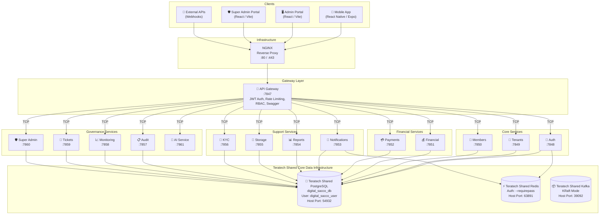

### Communication Patterns

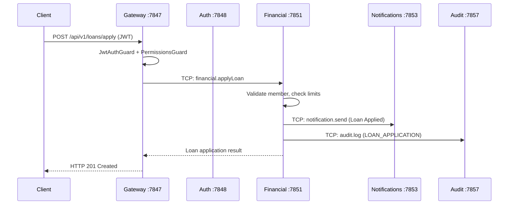

All inter-service communication uses **NestJS TCP Transport** (not HTTP). The gateway is the only service that exposes HTTP endpoints.

### Multi-Tenant Data Isolation

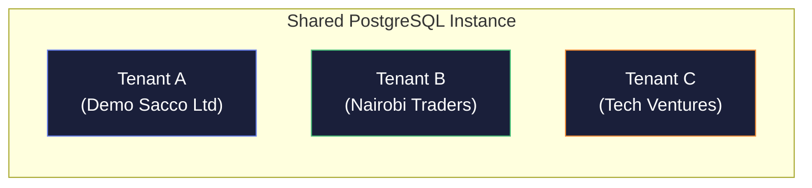

Every database model includes a `tenantId` foreign key. All queries are automatically scoped to the tenant of the authenticated user. **Super Admins** can bypass tenant scoping for platform-wide operations.

---

## 3. Microservices Deep Dive

### 3.1 API Gateway (Port 7847)

The central entry point for all client requests. Handles:

| Capability | Implementation |
|-----------|---------------|
| **Routing** | 221 endpoints routing to 15 microservices |
| **Authentication** | JWT verification via `JwtAuthGuard` |
| **Authorization** | Role-based access via `PermissionsGuard` with `@RequirePermissions()` |
| **Rate Limiting** | `@nestjs/throttler` — 100 req/60s per IP |
| **API Documentation** | Swagger/OpenAPI at `/api/v1/docs` |
| **API Keys** | `ApiKeyGuard` for external integrations |
| **Tenant Resolution** | Extracts `tenantId` from JWT payload |

**Route Groups:**

- `/auth/*` — Login, Register, MFA, Password Reset, Sessions
- `/tenants/*` — CRUD, Branding, Payment Configs
- `/members/*` — CRUD, Approval, KYC, Import, Dashboards
- `/savings/*` — Products, Accounts, Deposits, Withdrawals
- `/shares/*` — Config, Purchase, Transfer, Dividends
- `/loans/*` — Products, Apply, Approve, Disburse, Repay, Guarantors
- `/payments/*` — M-Pesa, Airtel, Card, Bank
- `/notifications/*` — Send, List, Mark Read, Webhooks
- `/reports/*` — Financial Summaries, Statements, Exports
- `/storage/*` — File Upload/Download
- `/kyc/*` — Document Submission, Verification
- `/audit/*` — Logs, Archives
- `/monitoring/*` — Service Health, Logs
- `/tickets/*` — Support Tickets
- `/super-admin/*` — Platform Dashboard, Tenant Management
- `/ai/*` — Chatbot, Financial Analysis
- `/insurance/*` — Products, Policies, Claims
- `/investments/*` — Products, Accounts

---

### 3.2 Auth Service (Port 7848)

The authentication and authorization backbone.

**Core Features:**

| Feature | Details |
|---------|---------|
| **Registration** | Email/phone registration with tenant assignment, automatic member profile creation |
| **Login** | Email or phone + password, automatic MFA trigger |
| **Multi-Factor Auth** | SMS OTP, Email OTP, TOTP (authenticator app) with QR code setup |
| **JWT Tokens** | Access token (15min), Refresh token (7d), JTI-based blacklisting via Redis |
| **Session Management** | List active sessions, revoke individual or all sessions |
| **Password Management** | Change password, forgot password (3-step OTP flow), password history enforcement |
| **Multi-Tenant Selection** | Users with multiple SACCO memberships select their active tenant with `tempToken` validation |
| **Role-Based Access Control** | Custom roles with granular permissions (Resource × Action matrix) |
| **Impersonation** | Super admins can impersonate users/tenants for support |
| **Transaction OTP** | Separate OTP flow for high-value financial transactions |
| **Audit Integration** | All auth events are logged to the Audit service |

**Token Flow:**

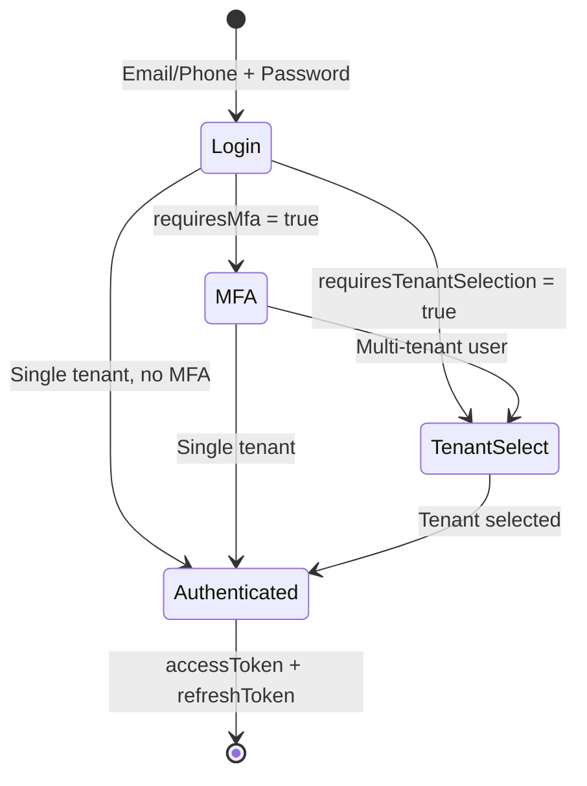

---

### 3.3 Tenants Service (Port 7849)

Manages SACCO/Chama organizations on the platform.

- **Tenant CRUD** — Create new SACCOs with admin user + default roles, update details, activate/suspend
- **Branding** — Custom logo, colors, tagline per tenant (served to admin/mobile login screens)
- **Payment Configuration** — Per-tenant M-Pesa, Airtel Money, Flutterwave credentials
- **Dashboard Stats** — Member count, total savings, active loans, revenue
- **Platform Dashboard** — Cross-tenant aggregation for super admins
- **API Key Management** — Generate/rotate API keys for external integrations
- **Webhook Management** — Register webhook URLs for event notifications

---

### 3.4 Members Service (Port 7850)

Manages SACCO member lifecycle.

- **Member CRUD** — List (paginated, filterable), view profile, update, delete (soft delete)
- **Approval Workflow** — New members go through PENDING → APPROVED/REJECTED flow
- **KYC Status Tracking** — NOT_SUBMITTED → PENDING → VERIFIED/REJECTED
- **Member Dashboard** — Account balances (savings, shares, loans), recent transactions, pending actions
- **Bulk Import** — CSV import for batch member onboarding with auto-password generation
- **Payment Methods** — Stored M-Pesa, bank details per member
- **Profile Management** — National ID, address, next of kin, employment details

---

### 3.5 Financial Service (Port 7851)

The core financial engine — the largest service with 43+ methods and sub-services.

**Savings Module:**
- Savings Products (configurable interest rates, compounding periods, min/max deposits)
- Savings Accounts (auto-created per member per product)
- Deposits & Withdrawals with full transaction logging
- **Cash Deposit Approval Workflow** — Cash deposits are created with `PENDING` status and do not immediately credit the member's balance. An admin must approve the transaction before funds are applied. Non-cash channels (M-Pesa, bank transfer) are auto-completed.
- Interest Calculation (reducing balance, flat rate)

**Shares Module:**
- Share Capital Configuration (price per share, min/max holdings)
- Share Purchase & Transfer (with OTP verification)
- Transfer Approval Workflow
- Dividend Distribution & Posting

**Loans Module:**
- Loan Products (interest rate, tenure, calculation method, fees)
- Loan Application with repayment schedule preview (maps `amount` and `principal` correctly)
- Guarantor System (add guarantors, accept/reject guarantorship)
- Loan Approval, Rejection, Disbursement workflow
- Loan Repayment (M-Pesa, cash, bank transfer)
- Loan Agreement Digital Signing (IP + User Agent capture)
- Loan Rescheduling
- Penalty Calculation (late payment fees)
- Loan Calculator (amortization, reducing balance, flat rate)

**Advanced Financial Features:**
- **Double-Entry Accounting** (`AccountingService`) — Chart of accounts, journal entries
- **CRB Integration** (`CrbService`) — Credit bureau reporting
- **Insurance** (`InsuranceService`) — Products, policies, claims
- **Investments** (`InvestmentService`) — Fixed deposit products, accounts
- **Recurring Contributions** (`RecurringService`) — Automated scheduled payments

---

### 3.6 Payments Service (Port 7852)

Handles all payment processing across multiple channels.

| Channel | Provider | Features |
|---------|----------|----------|
| **M-Pesa** | Safaricom Daraja API | STK Push, C2B registration, B2C disbursements, Callbacks |
| **Airtel Money** | Airtel Money API | Payment initiation, callbacks, status check, disbursements |
| **Card Payments** | Flutterwave | Payment initialization, verification, webhooks |
| **Bank Transfer** | Manual | Record deposits, verify transfers |
| **Recurring** | Internal | Automated contribution processing |

---

### 3.7 Notifications Service (Port 7853)

Multi-channel notification delivery.

| Channel | Provider | Use Cases |
|---------|----------|-----------|
| **Email** | SendGrid / SMTP | OTP codes, loan approvals, statements, announcements |
| **SMS** | Africa's Talking | OTP codes, payment confirmations, reminders |
| **Push** | Firebase Cloud Messaging (FCM) | Real-time alerts on mobile |
| **In-App** | Database-stored | Notification center in mobile/web apps |
| **Webhook** | HTTP POST | External system notifications |

Features: Bulk notifications, webhook management (register/dispatch/retry), system configuration, notification preferences.

---

### 3.8 Reports Service (Port 7854)

Financial reporting and document generation.

| Report | Format | Description |
|--------|--------|-------------|
| **Cash Flow** | JSON | Inflows, outflows, net position by period |
| **Portfolio at Risk (PAR)** | JSON | Aging analysis of overdue loans |
| **Financial Summary** | JSON | Total savings, loans, shares, revenue |
| **SASRA Report** | JSON | Regulatory compliance report |
| **Loan Portfolio** | JSON | Disbursement, repayment, default analysis |
| **Member Growth** | JSON | Monthly membership trend |
| **Transaction Report** | JSON | Filterable transaction log |
| **Account Statement** | PDF | Per-member savings/loan statement with branding |
| **Excel Export** | XLSX | Members, loans, savings, transactions, shares |
| **Dividend Preview** | JSON | Per-member dividend calculation before posting |
| **Accounting Data** | JSON | Chart of accounts with trial balance |

---

### 3.9 Storage Service (Port 7855)

File management backed by AWS S3.

- File upload (KYC documents, profile photos, attachments)
- Presigned URL generation for secure downloads
- File metadata tracking in database

---

### 3.10 KYC Service (Port 7856)

Know Your Customer document management.

- Document types: National ID, Passport, KRA PIN, Proof of Address
- Status workflow: NOT_SUBMITTED → PENDING → VERIFIED / REJECTED
- Admin review interface with approval/rejection reasons
- Integration with Storage service for document files

---

### 3.11 Audit Service (Port 7857)

Platform-wide activity logging.

- Every significant action is logged (financial transactions, auth events, admin actions)
- Filterable by tenant, user, action type, date range
- Archive capability for compliance
- Used for regulatory reporting

---

### 3.12 Monitoring Service (Port 7858)

Service health and performance tracking.

- Service registry with health status
- Service logs aggregation
- Performance metrics collection
- Alert system for service degradation

---

### 3.13 Tickets Service (Port 7859)

Member support ticket system.

- Categories: GENERAL, LOAN, SAVINGS, ACCOUNT, TECHNICAL
- Priority levels: LOW, MEDIUM, HIGH, URGENT
- Status workflow: OPEN → IN_PROGRESS → RESOLVED / CLOSED
- Threaded messages between members and admins

---

### 3.14 Super Admin Service (Port 7860)

Platform-wide administration (bypasses tenant scoping).

| Feature | Description |
|---------|-------------|
| **Platform Dashboard** | Total tenants, members, savings, loans, revenue across all SACCOs |
| **Tenant Management** | CRUD tenants, activate/suspend/deactivate, manage subscriptions |
| **Subscription Plans** | FREE, BASIC, PROFESSIONAL, ENTERPRISE tiers |
| **Audit Logs** | Platform-wide audit trail with filters |
| **System Configuration** | Key-value configuration store (email/SMS settings, feature flags) |
| **Announcements** | Platform-wide or tenant-specific announcements |
| **Maintenance Mode** | Global maintenance mode toggle with custom message |
| **Revenue Stats** | Platform revenue tracking and analytics |
| **User Impersonation** | Login as any user or tenant admin for support |

---

### 3.15 AI Service (Port 7861)

Chatbot and intelligent assistance.

- Financial analysis chatbot
- Natural language query processing
- Member assistance and FAQ

---

## 4. Database Schema

### Overview

The database contains **50 models** and **31 enums**, managed by Prisma ORM with a single shared PostgreSQL instance.

### Entity Relationship Diagram

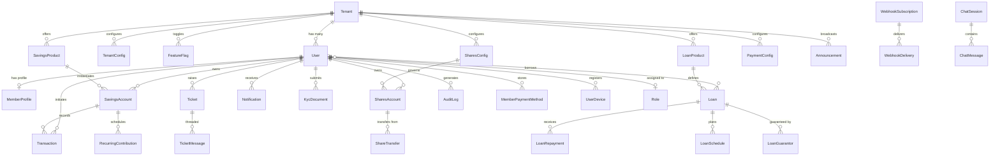

### Key Models

| Model | Records | Purpose |
|-------|---------|---------|
| `Tenant` | Multi-tenant SACCOs | Organization entity with branding, config, subscription |
| `User` | Auth identities | Login credentials, role, MFA settings, tenant association |
| `MemberProfile` | Extended member data | National ID, address, employment, next of kin |
| `SavingsProduct` | Product catalog | Interest rates, compounding, limits |
| `SavingsAccount` | Member accounts | Balance, status, product association |
| `LoanProduct` | Loan types | Interest, tenure, calculation method, fees |
| `Loan` | Active/past loans | Principal, balance, schedule, status |
| `LoanGuarantor` | Loan guarantees | Guarantor member, amount pledged, acceptance |
| `Transaction` | Financial transactions | All money movements with double-entry references |
| `SharesAccount` | Member share holdings | Share count, value |
| `GLAccount` | Chart of accounts | Account code, type (ASSET/LIABILITY/EQUITY/REVENUE/EXPENSE) |
| `JournalEntry` | Accounting entries | Double-entry journal with line items |
| `PaymentConfig` | Payment gateway creds | Per-tenant M-Pesa/Airtel/Card/Bank configuration |
| `Notification` | User notifications | Multi-channel (email, SMS, push, in-app) |
| `AuditLog` | Activity log | Action, actor, resource, IP, user agent |
| `KycDocument` | KYC files | Document type, status, review notes |
| `Role` | Custom roles | Named permission sets per tenant |

### Enums (31 total)

| Category | Enums |
|----------|-------|
| **Organization** | `TenantStatus`, `DeploymentMode`, `SubscriptionPlan` |
| **User** | `UserRole`, `UserStatus`, `KycStatus`, `MfaType` |
| **Financial** | `AccountStatus`, `TransactionType`, `TransactionStatus`, `PaymentChannel`, `LoanStatus`, `LoanCalculationMethod`, `CompoundingPeriod`, `PenaltyType`, `ShareTransferStatus` |
| **Accounting** | `GLAccountType`, `JournalEntryStatus` |
| **Notifications** | `NotificationType`, `NotificationChannel` |
| **KYC** | `KycDocType`, `KycDocStatus`, `OtpPurpose` |
| **Support** | `TicketCategory`, `TicketPriority`, `TicketStatus` |
| **Recurring** | `RecurringFrequency`, `RecurringStatus` |
| **Infrastructure** | `ServiceStatus`, `LogLevel`, `ChatSessionStatus` |

---

## 5. Client Applications

### 5.1 Mobile App (React Native + Expo SDK 54)

The member-facing mobile application. **Only users with the `MEMBER` role can log in.** Tenant Admins and Super Admins attempting to log in via the mobile app will receive a "User not found" error. This is enforced server-side using a `platform: 'mobile'` flag sent with every login request.

**In-App SACCO Switching (SSO):**
Members belonging to multiple SACCOs can seamlessly switch between their active tenant profiles using the "Switch SACCO" modal in the More tab. This queries the `auth.myTenants` API and uses existing single sign-on (SSO) credentials to issue fresh JWTs without forcing the user to log out and re-enter passwords.

**Key Screens:**
- **Login** — Phone/email login, MFA OTP verification (auto-verify on 6th character), multi-SACCO selection. Rejects `TENANT_ADMIN` and `SUPER_ADMIN` roles with "User not found" toast
- **Dashboard** — Account balances (savings, shares, loans), recent transactions, quick actions
- **Savings** — Deposit, withdraw, view statement, recurring contributions
- **Shares** — Purchase shares, transfer shares (with OTP), view holdings
- **Loans** — Apply for loan, repayment schedule, make repayment, loan calculator
- **Transactions** — Full transaction history with filters and pagination
- **Notifications** — In-app notification center with read/unread, delete
- **Profile** — Personal details, KYC document upload, payment methods
- **Settings** — Biometric login, change password, active sessions
- **More** — Switch SACCOs, theme toggle, privacy mode, logout

**Technical Details:**
- Navigation: `@react-navigation/native-stack` + `@react-navigation/bottom-tabs`
- State: React Context (AuthContext, ThemeContext)
- API: Axios with automatic JWT refresh interceptor
- Storage: `expo-secure-store` (tokens), `@react-native-async-storage` (cache)
- Biometrics: `expo-local-authentication`
- Lists: `@shopify/flash-list` with pagination

### 5.2 Admin Portal (React 19 + Vite 6)

The tenant-specific management dashboard for SACCO administrators.

**Key Pages:**
- **Dashboard** — KPIs, charts (member growth, loan portfolio, savings trend)
- **Members** — List, approve/reject, view profiles, import CSV, KYC review
- **Savings** — Products CRUD, account management, interest calculation trigger
- **Loans** — Applications queue, approve/reject/disburse, repayment tracking
- **Shares** — Config, transfer approvals, dividend distribution
- **Payments** — Transaction history, M-Pesa/Airtel config
- **Reports** — Financial summary, SASRA report, Excel exports, PDF statements
- **Announcements** — Create/manage tenant-specific announcements
- **Settings** — Tenant branding, payment configs, roles & permissions
- **Tickets** — Support ticket management

**Technical Details:**
- Routing: `react-router-dom` v7
- UI: Custom design system with glassmorphism, dark mode
- Charts: `recharts`
- i18n: `react-i18next` (multi-language support)
- Data export: `papaparse` (CSV)

### 5.3 Super Admin Portal (React 19 + Vite 6)

Platform-wide administration for Akiba360 operators.

**Key Pages:**
- **Platform Dashboard** — Total tenants, members, revenue, system health
- **Tenant Management** — List/create/edit tenants, activate/suspend, subscription management
- **Tenant Detail** — Deep dive into individual SACCO metrics and members
- **Audit Logs** — Platform-wide activity trail with advanced filters
- **System Configuration** — Email/SMS/push notification settings
- **Announcements** — Platform-wide broadcast messages
- **Maintenance Mode** — Enable/disable with custom message
- **User Provisioning & Delegation** — Create and configure administrative users (`POST /api/v1/super-admin/users`)
- **User Impersonation** — Login as tenant admin for support

### 5.4 OmniComms Admin Dashboard (React 19 + Vite 6)

The standalone **OmniComms Enterprise Communications Suite** (`apps/comms-dashboard`, port `7891`).

**Full Suite Modules:**
1. **📊 System Command Center** — Real-time throughput metrics, delivery success gauge, and background worker telemetry.
2. **🏢 Applications & API Keys** — Multi-tenant project registration, cryptographic API key generation, and rate limits.
3. **📜 Message & Delivery Receipts Explorer** — Paginated dispatch ledger with transient payload pruning.
4. **🎨 Template Studio & Visual Engine** — Visual Handlebars editor with Desktop/Mobile responsive live preview and mock variables.
5. **🔑 Central 2FA & OTP Sessions Vault** — Active session TTL countdown meters, attempt tracking, and manual revocation.
6. **⚡ Queue & DLQ Mission Control** — Ingestion counters, background worker fleet concurrency, bulk retry, and DLQ purge.
7. **📻 Provider Gateway Routing** — Multi-provider failover routing (Gmail SMTP, SendGrid, Africa's Talking, Twilio).
8. **🧪 Interactive Developer Sandbox** — Live API test simulator with instant cURL, TypeScript, and Python code generation.
9. **🛡️ Security & Compliance Audit Log** — Immutable record of key rotations, provider credential changes, and access events.

---

## 6. Authentication, Security & Password Reset

### Authentication Flow

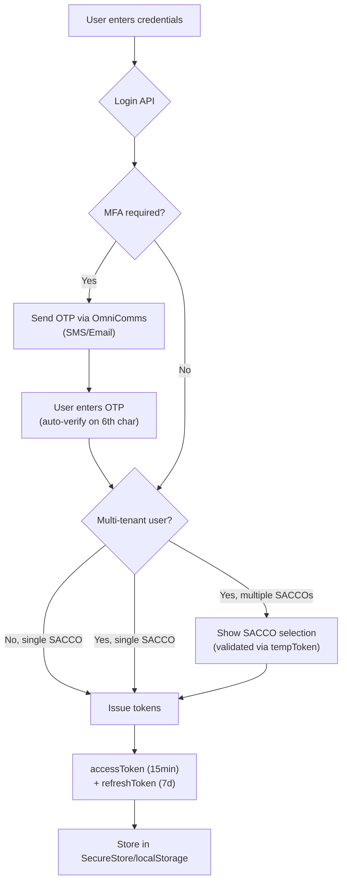

### Self-Service Password Reset Journey

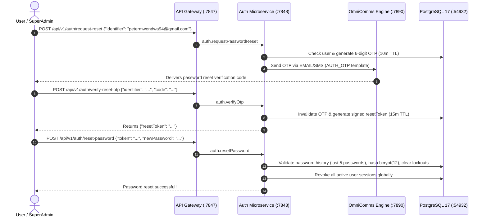

### Security Mechanisms

| Mechanism | Implementation |
|-----------|---------------|
| **Universal SuperAdmin** | `petermwendwa94@gmail.com` with master global permissions across all platforms |
| **Admin User Provisioning** | SuperAdmin can provision `TENANT_ADMIN`, `ACCOUNTANT`, `LOAN_OFFICER`, `SUPPORT_ADMIN` via `POST /api/v1/super-admin/users` |
| **JWT with JTI** | Every token has a unique JTI; blacklisted JTIs stored in Redis for instant revocation |
| **Token Refresh** | Silent refresh via interceptor when access token expires |
| **MFA** | SMS OTP, Email OTP, and TOTP (Google Authenticator) dispatched via OmniComms |
| **Transaction OTP** | Separate OTP required for high-value operations (share transfers) |
| **Password History** | Last 5 passwords stored (bcrypt hashed); prevents reuse |
| **Rate Limiting** | 100 requests per 60 seconds per IP at gateway level |
| **RBAC** | Resource × Action permission matrix (e.g., `LOANS:APPROVE`) |
| **Platform-Based Access** | Mobile app sends `platform: 'mobile'` flag; auth service rejects non-MEMBER roles (TENANT_ADMIN, SUPER_ADMIN) with "User not found" |
| **Tenant Isolation** | All database queries scoped by `tenantId` from JWT. **SSO token refresh** handles seamless in-app SACCO switching. |
| **Transient Payload Pruning** | Delivered notification payloads are pruned (`fullPayload: null`) to prevent PII/financial leakage |
| **API Keys** | Multi-tenant cryptographically isolated API keys (`omni_live_*`) |
| **CORS** | Configurable origin whitelist |

### Permission Model

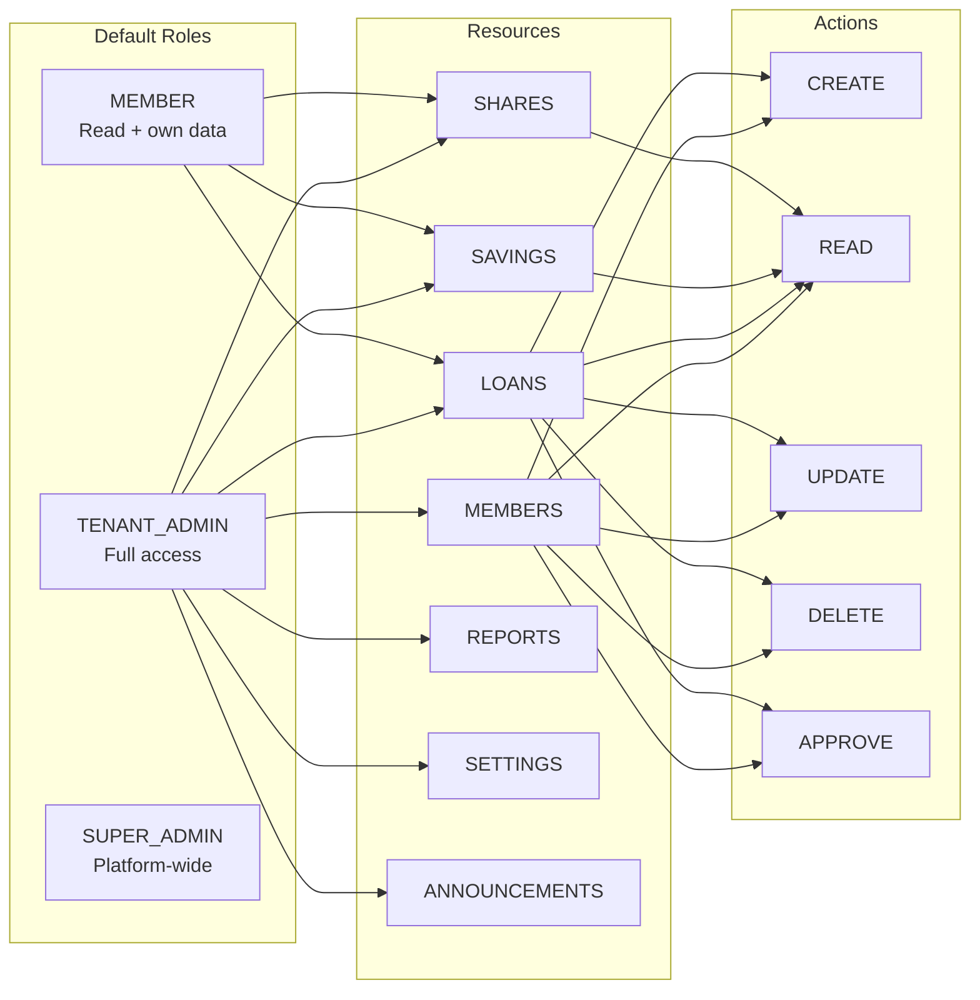

---

## 7. Payment Integrations

### M-Pesa (Safaricom Daraja API)

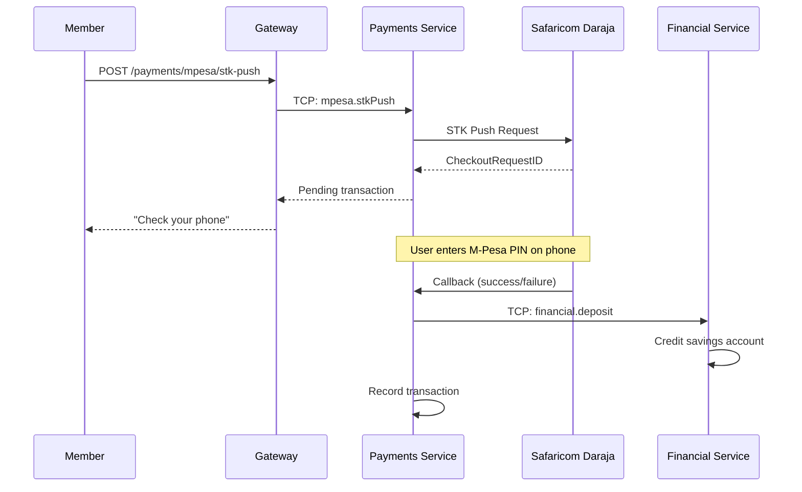

### Supported Payment Channels

| Channel | Direction | Use Cases |
|---------|-----------|-----------|
| M-Pesa STK Push | Inbound | Savings deposits, loan repayments, share purchases |
| M-Pesa C2B | Inbound | Paybill / Till number payments |
| M-Pesa B2C | Outbound | Loan disbursements, withdrawals |
| Airtel Money | Inbound/Outbound | Same as M-Pesa for Airtel subscribers |
| Card (Flutterwave) | Inbound | Visa/Mastercard payments |
| Bank Transfer | Inbound | Manual bank deposit recording |

---

## 8. Infrastructure & Deployment

### Docker Architecture

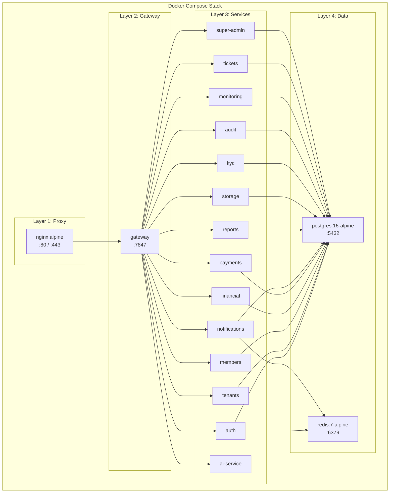

### Shared Dockerfile

All 14 backend services use a single `services/Dockerfile` with a `SERVICE` build arg:

```dockerfile
FROM node:20-alpine AS builder
ARG SERVICE
# Copy shared packages, Prisma schema, service source
# Install, generate Prisma, build
FROM node:20-alpine
# Copy dist, node_modules, prisma schema
CMD ["sh", "-c", "node dist/main.js"]
```

### Port Mapping

| Service | Internal Port | External Port |
|---------|--------------|---------------|
| Gateway | 7847 | 7847 |
| Auth | 7848 | — (internal) |
| Tenants | 7849 | — |
| Members | 7850 | — |
| Financial | 7851 | — |
| Payments | 7852 | — |
| Notifications | 7853 | — |
| Reports | 7854 | — |
| Storage | 7855 | — |
| KYC | 7856 | — |
| Audit | 7857 | — |
| Monitoring | 7858 | — |
| Tickets | 7859 | — |
| Super Admin | 7860 | — |
| AI Service | 7861 | — |
| Admin Frontend | 80 | 3000 |
| Superadmin Frontend | 80 | 3001 |
| PostgreSQL | 5432 | 5433 |
| Redis | 6379 | 6379 |
| NGINX | 80/443 | 80/443 |

### Kubernetes (k8s/)

The `k8s/` directory contains production manifests:

| File | Contents |
|------|----------|
| `00-namespace.yml` | `akiba360` namespace |
| `01-secrets.yml` | Database credentials, JWT secrets |
| `02-infrastructure.yml` | PostgreSQL + Redis deployments |
| `03-backend-services.yml` | All 15 microservice Deployments + Services |
| `04-frontend-apps.yml` | Admin + Superadmin Deployments |
| `05-ingress.yml` | NGINX Ingress with TLS |

### Load Balancing & High Availability

The Akiba360 platform implements load balancing natively across both deployments:

#### 1. Docker Compose (Local / Staging)
- **NGINX Reverse Proxy:** The `nginx` container sits at the front, actively acting as both a proxy and a Layer 7 load balancer.
- **Round-Robin DNS:** Docker's internal DNS resolver (`127.0.0.11`) maps the service names (e.g., `gateway`, `admin`) to multiple underlying container IP addresses if the service is scaled.
- **Scaling:** To scale a service and have NGINX load balance traffic across the instances, use Docker Compose scaling:
  ```bash
  docker compose up -d --scale gateway=3 --scale auth=2
  ```

#### 2. Kubernetes (Production)
- **Ingress Controller:** The NGINX Ingress Controller handles SSL termination and Layer 7 path-based routing externally (`/api/*` to gateway, `/admin/*` to admin, etc.).
- **Native Service Load Balancing:** The Kubernetes `Service` layer natively provides load balancing (Layer 4) across multiple pods.
- **Replica Sets:** The `03-backend-services.yml` and `04-frontend-apps.yml` manifests are configured with `replicas: > 1` (e.g. Gateway: 3, Auth: 3, Admin: 2). The Kubernetes load balancer actively round-robins traffic automatically as pods scale up or down based on load.

---

## 9. CI/CD Pipeline

### Pipeline Architecture

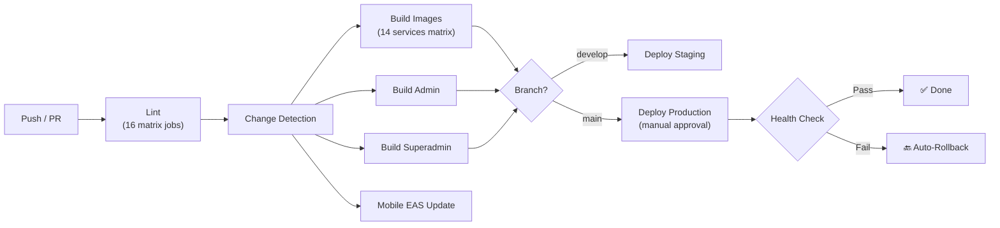

### Key Features

- **Smart Change Detection** — Only rebuilds services whose code changed
- **Matrix Parallelism** — 14 microservices build simultaneously
- **Docker Layer Caching** — GitHub Actions GHA cache for fast rebuilds
- **Selective Deployment** — `docker compose up -d` natively detects image digest changes, deploying ONLY the containers that were actually updated, without restarting unchanged ones
- **Auto-Rollback** — Restores previous state if health checks fail
- **Manual Approval Gate** — Production requires reviewer approval
- **Mobile OTA** — Expo EAS updates for instant mobile pushes

---

## 10. API Reference

### Base URL

```
https://<domain>/api/v1
```

### Authentication Headers

```
Authorization: Bearer <accessToken>
x-tenant-id: <tenantId>  (auto-extracted from JWT)
```

### Endpoint Summary (221 routes)

| Group | Method | Route | Description |
|-------|--------|-------|-------------|
| **Health** | GET | `/health` | Gateway health check |
| **Auth** | POST | `/auth/login` | Login with email/phone + password |
| | POST | `/auth/register` | Self-registration |
| | POST | `/auth/refresh` | Refresh access token |
| | POST | `/auth/select-tenant` | Multi-tenant SACCO selection |
| | POST | `/auth/logout` | Logout current session |
| | POST | `/auth/change-password` | Change password |
| | POST | `/auth/forgot-password` | Request password reset OTP |
| | POST | `/auth/mfa/setup` | Setup MFA (TOTP QR code) |
| | POST | `/auth/mfa/login` | Verify MFA OTP |
| **Tenants** | GET | `/tenants` | List tenants (Super Admin) |
| | GET | `/tenants/branding` | Get tenant branding by slug |
| | PUT | `/tenants/:id` | Update tenant |
| **Members** | GET | `/members` | List members (paginated) |
| | GET | `/members/dashboard` | Member dashboard data |
| | POST | `/members` | Create member (admin) |
| | PUT | `/members/:id/approve` | Approve membership |
| | POST | `/members/import` | Bulk CSV import |
| **Savings** | GET | `/savings/products` | List savings products |
| | GET | `/savings/accounts` | My savings accounts |
| | POST | `/savings/deposit` | Make deposit |
| | POST | `/savings/withdraw` | Request withdrawal |
| **Shares** | GET | `/shares/account` | My share holdings |
| | POST | `/shares/purchase` | Buy shares |
| | POST | `/shares/transfer` | Transfer shares (OTP required) |
| | POST | `/shares/dividends` | Distribute dividends (admin) |
| **Loans** | GET | `/loans` | List loans |
| | POST | `/loans/apply` | Apply for loan |
| | PUT | `/loans/:id/approve` | Approve loan (admin) |
| | PUT | `/loans/:id/disburse` | Disburse loan (admin) |
| | POST | `/loans/:id/repay` | Make repayment |
| | POST | `/loans/:id/guarantors` | Add guarantor |
| **Payments** | POST | `/payments/mpesa/stk-push` | Initiate M-Pesa STK Push |
| | POST | `/payments/mpesa/callback` | M-Pesa webhook callback |
| | POST | `/payments/card/initialize` | Initiate card payment |
| **Reports** | GET | `/reports/financial-summary` | Financial summary |
| | GET | `/reports/cash-flow` | Cash flow report |
| | GET | `/reports/sasra` | SASRA compliance report |
| | GET | `/reports/statement/pdf` | PDF account statement |
| | GET | `/reports/export/excel` | Excel data export |
| **Super Admin** | GET | `/super-admin/dashboard` | Platform dashboard |
| | GET | `/super-admin/tenants` | List all tenants |
| | PUT | `/super-admin/tenants/:id/status` | Update tenant status |
| | POST | `/super-admin/maintenance` | Toggle maintenance mode |

> This is a representative subset. The full API contains **221 endpoints**. Use Swagger at `/api/v1/docs` for the complete interactive reference.

---

## Document Revision

| Version | Date | Author | Changes |
|---------|------|--------|---------|
| 1.0 | 2026-02-24 | Akiba360 Team | Initial comprehensive documentation |

---

## 🔒 Database Indexing & Performance Strategy

This project leverages the **Teratech Enterprise Shared Infrastructure Architecture** on PostgreSQL 17:

### 1. B-Tree Indexes ((\log N)$ Lookup)
- **Primary & Foreign Keys**: B-Tree indexes on uid=502(petermutua) gid=20(staff) groups=20(staff),12(everyone),61(localaccounts),79(_appserverusr),80(admin),81(_appserveradm),701(com.apple.sharepoint.group.1),33(_appstore),98(_lpadmin),100(_lpoperator),204(_developer),250(_analyticsusers),395(com.apple.access_ftp),398(com.apple.access_screensharing),399(com.apple.access_ssh),400(com.apple.access_remote_ae),702(com.apple.sharepoint.group.2), , , and relational foreign keys.
- **Unique Constraints**: Unique B-Tree indexes for fast login lookups and record uniqueness.

### 2. Multi-Tenant Composite Indexes
- Compound indexes with  leading column (e.g. , ).
- Guarantees sub-millisecond query execution and strict tenant data isolation.

### 3. Advanced Index Types (where applicable)
- **GIN Indexes**: Fast JSONB metadata search and full-text search vectors.
- **HNSW Vector Indexes**: Sub-2ms nearest-neighbor AI embedding queries ().
- **Connection Pooling**: PgBouncer multiplexing for high concurrency and low memory overhead.

---

## ⚡ High-Throughput (10M+ Requests) & Data Export Architecture

This system is engineered to handle **10 Million+ Read, Write, and Data Export Requests** using a multi-tiered database performance strategy:

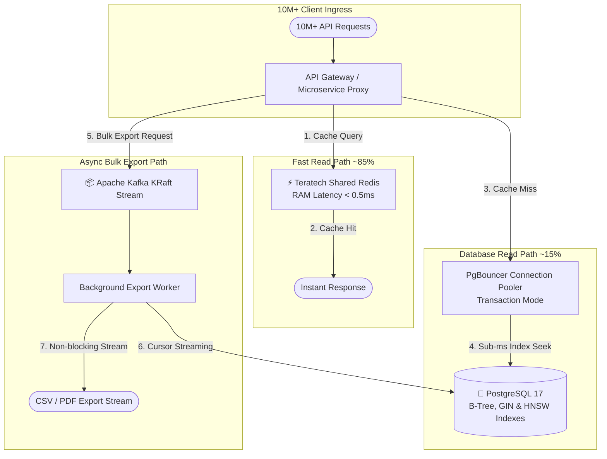

### Performance & Scalability Guarantees
1. **Sub-Millisecond Read Latency**: O(log N) B-Tree and multi-tenant composite indexes (`@@index([tenantId, ...])`).
2. **RAM Offloading**: Redis caches up to 85%+ of read requests.
3. **Cursor-Based Streaming**: Bulk data exports stream records via Cursor Pagination (`take: 1000`, `cursor: { id }`) rather than memory-heavy offset scans.
4. **Non-Blocking Async Offloading**: Heavy export tasks queue through Apache Kafka.
